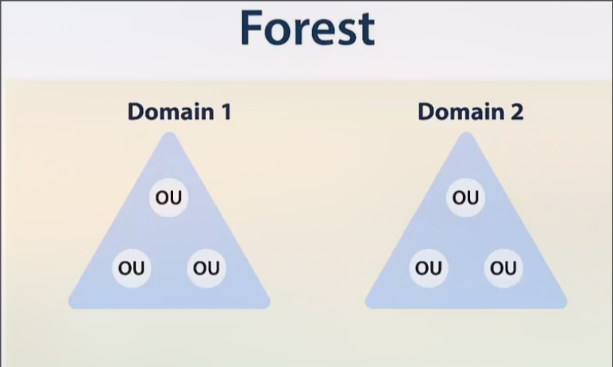

# Active Directory

## Components
- <b>Schema</b>: Defines objects and their attributes
- <b>Query and Index Mechanism</b>: Provides searching and publication of objects and their properties
- <b>Global Catalog</b>: Contains information about every object in the directory
- <b>Replication Service</b>: Distributes information across domain controllers

## Structure
Basic building blocks:
- Forest (Security boundary)
- Domains
- Organizational Units (<b>OU</b>)

 
Each forest may contain multiple domains.  
Each domain may contain multiple OUs.
  
When hearing "Active Directory", think <b>forests</b> instead of <b>domains</b>.
  
A <b>single</b> domain being compromised in a forest means that the <b>entire</b> forest is compromised.
