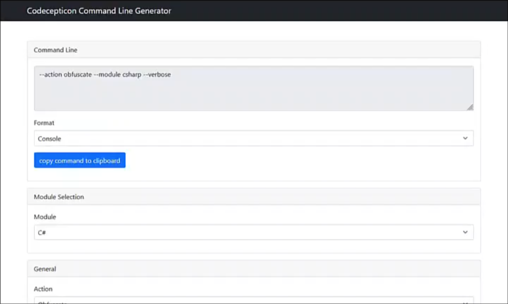

# Offensive .NET

## Tradecraft
Challenges when using .NET:
- Detection by countermeasures like AV, EDR, etc
- Delivery of the payload
- Detection by logging

## AV Bypass
- Source Code Obfuscation
    - [Codeception](https://github.com/Accenture/Codecepticon)
        - Compile the project in Visual Studio and navigate to the output directory
        - Open the CommandLineGenerator.html file
        
        OR 
        ```
        C:\AD\Tools\Codeception.exe --action obfuscate --module csharp --verbose --path "C:\AD\Tools\Rubeus-master\Rubeus.sln" --map-file "C:\AD\Tools\Rubeus-master\Mapping.html" --profile rubeus --rename ncefpavs --rename-method markov --markov-min-length 3 --markov-max-length 10 -- markov-min-words 3 --markov-max-words 5 --string-rewrite --string-rewrite-method xor
        ```
    - [ConfuserEx](https://mkaring.github.io/ConfuserEx/) 
        - Run ConfuserEx GUI
        - Add the release folder of the compiled binary to ConfuserEx
        - Add a new rule in the settings page
        - Double click the rule and set the preset to "Maximum"
        - In the protect page, click "Protect: to produce the obfuscated binary"
        - Verify with DefenderCheck
