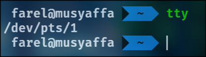

# /dev/pts

## What is it?
/dev/pts/ is the virtual file system where [pseudo terminal](<>) devices reside. When opening a new terminal instance, for example, the terminal application requests the kernel to create a new pseudo terminal, which is then assigned a unique number visible in `/dev/pts`. Use `tty` to determine the terminal device number assigned to the current terminal application in `/dev/pts`.

## Permissions and ownership?

