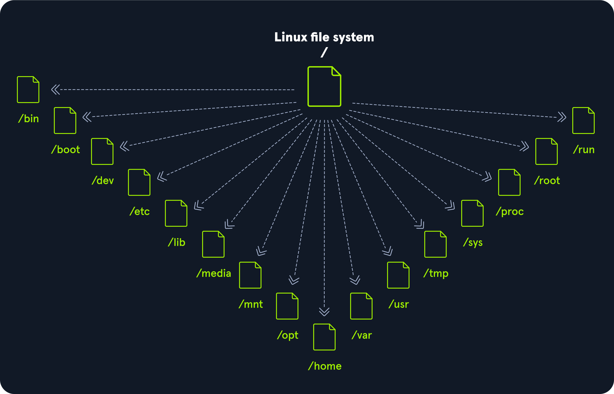

# LINUX STRUCTURE

## Philosophies
- **Everything is a file**   
Everything can be represented as a file: video streams, devices, drivers, various machine physical states like lid status (if a laptop lid is closed or open), etc are all represented as files in Linux. 
- **Small, single-purpose programs**   
Every program should be small and only do one thing instead of being huge do-it-all programs.
- **Ability to chain programs together for complex tasks**   
Programs (or outputs of programs) should be able to be chained together into other programs to achieve complex tasks.
- **Avoid captive user interfaces**   
Linux is designed to work mainly with the terminal, which gives the user greater control over the operating system overall. (***I personally think this is not true***)
- **Configuration data stored in text files**   
For example, */etc/passwd* stores the data about all registered users in the system. (***Which I also think is debatable***)

## Components
- **Bootloader**   
A program that initiates the booting sequence to start the operating system and the kernel.
- **Kernel**   
Main component of the OS that talks directly with the hardware and acts as an intermediary between software and hardware. 
- **Daemons**   
Background process that performs system tasks automatically, without requiring direct user interaction are called *daemons*. Daemons run in the background to provide certain system or application functionalities.
- **Shell**   
The shell or command line terminal is an interface that allows the user to execute commands to the operating system. 
- **Graphics Server**  
Graphics servers implement protocols (like X11 or Wayland) to allow applications to render graphics on the screen.
- **Window Manager**  
Window managers control the placement and appearance of windows. Some standalone window managers (like i3, Openbox) provide minimal environments, while full desktop environments (like GNOME, KDE Plasma) include window managers along with many additional applications.

## FILE SYSTEM HIERARCHY
Linux-based OSes are structured in a tree-like hierarchy.

- **/**  
Root, the top level directory that contains all of the files in a filesystem. If there are multiple filesystems in the OS, those filesystems can be mounted on at the standard mount points as subdirectories of the root. 
- **/bin**   
Contains binaries of essential applications/programs.
- **/boot**   
Contains bootloader files that are required for the system to boot into the OS. 
- **/dev**   
Contains device files to facilitate access to every hardware device attached to the system. 
- **/etc**   
Local system configuration files. Configuration files for installed applications may be saved here as well.
- **/home**   
Each user on the system has a subdirectory in the */home* directory to store things such as documents, images, videos, etc.
- **/lib**   
Contains essential shared libraries and kernel modules that are required to boot the system and run basic commands. It's critical for the system startup and for basic functionality even before any other filesystems are mounted.
- **/media**   
Removable external media devices such as USB drives are mounted here.
- **/mnt**   
Temporary mount point for regular filesystems. 
- **/opt**   
Optional files such as third party tools may be saved here. 
- **/root**   
The home directory for the root user.
- **/sbin**   
Contains executables (binaries) used for system administration (binary system files)
- **/tmp**   
Contains temporary files. Generally cleared upon system boot and may be deleted at other times without any warning.
- **/usr**   
Contains executables, libraries, man files, etc.
- **/var**   
Contains variable data files such as log files, email inboxes, web-app related files, cron files, etc.

