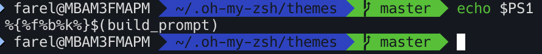

# PROMPT DESCRIPTIONS

## PS1 Variable
PS1 Variable in Linux controls how the command prompt looks in the terminal. 

Above is the example of the PS1 variable that follows an Oh-My-Zsh theme. It controls everything from the farel string to the master string. 

The following are special characters and what they do to the prompt:

- `\d`   
Date (Mon Feb 6)
- `\D{%Y-%m-%d}`   
Date (YYYY-MM-DD)
- `\H`   
Full hostname
- `\j`   
Number of jobs managed by the shell
- `\n`   
Newline
- `\r`   
Carriage return
- `\s`   
Name of the shell
- `\t`   
Current time 24-hour (HH:MM:SS)
- `\T`   
Current time 12-hour (HH:MM:SS)
- `\@`   
Current time
- `\u`   
Current username'
- `\w`   
Full path of the current directory 
