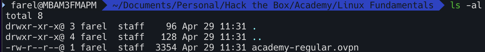
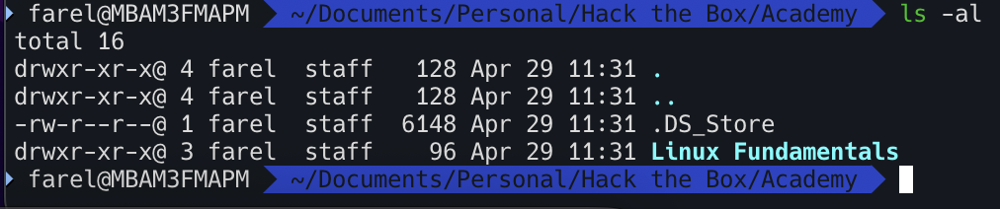

# NAVIGATION

## `ls` columns

- `-rw-r--r--`   
Permission bits. Specifies permission of the current file/directory.   
In this case, it's a file (`-`) which the file owner can read and write but not execute (`rw-`), users in the `staff` group can read but not write nor execute (`r--`), and any other user can read but not write nor execute (`r--`).     
**Others** scope refers to any other user outside of the user that owns the corresponding file and the user group that the file owner user belongs to.  

| Position | Scope     | Symbol | Description                                 | Octal | Meaning                     |
|----------|-----------|--------|---------------------------------------------|-------|-----------------------------|
| 1        | File type | - d l  | `-` = file, `d` = dir, `l` = link, etc.      | —     | File type indicator         |
| 2        | User      | r      | Read permission for owner                   | 4     | Can read file/list dir      |
| 3        | User      | w      | Write permission for owner                  | 2     | Can write/delete/rename     |
| 4        | User      | x / s  | Execute or setuid                           | 1 / 4k| Run file / run as owner     |
| 5        | Group     | r      | Read permission for group                   | 4     | Can read file/list dir      |
| 6        | Group     | w      | Write permission for group                  | 2     | Can write/delete/rename     |
| 7        | Group     | x / s  | Execute or setgid                           | 1 / 2k| Run file / run as group     |
| 8        | Others    | r      | Read permission for others                  | 4     | Can read file/list dir      |
| 9        | Others    | w      | Write permission for others                 | 2     | Can write/delete/rename     |
| 10       | Others    | x / t  | Execute or sticky bit                       | 1 / 1k| Run file / restrict delete  |

- `1`   
Number of hard links to the file/directory. That means, a file will always have the value `1`, and directories will have the value of however many hardlinks are in that directory.      
The `.` entry refers to the current working directory, and since the current working directory has 3 hard links (`.`, `..`, and `academy-regular.ovpn`), this column's value is 3.   

On the other hand, the `..` refers to the parent directory, which is the `Academy` directory which contains 4 hard links (`.`, `..`, `.DS_Store`, and `Linux Fundamentals`).

- `farel`  
Owner of the current entry

- `staff`  
Group owner of the current entry. Usually refers to the owner user's main group, but this can be changed with the command `chgrp`. For example, `sudo chgrp group1 file.txt`.

- `96`  
Size of the file in bytes.

- `Apr 29 11:31`  
Date and time of the last update/modification to the file/directory

- `academy-regular.ovpn`  
Name of the entry

## Index Numbers

Use the `-i` argument with `ls` to show the index number (inodes) of each entry. `stat` command could also be used to find the inode number and its attributes.

## Finding the last modified file

`find . -type f -printf '%T@ %p\n' | sort -k1,1nr | head -5`

## inodes

Each object in the UNIX filesystem is represented by an inode. Each and every file has the following attributes:  

- **File type**
- **Permissions**
- **Owner**
- **Group**
- **File size**
- **File access, change, and modification time**   
***NOTE: Linux never stores file creation time***
- **File deletion time**
- **Number of links**
- **Extended attributes**
- **Access control lists (ACLs)**

All of these attributes are stored in an inode. The inode identifies the file and its attributes. Each inode is identified by unique inode number within the file system, also known as an index number. 
